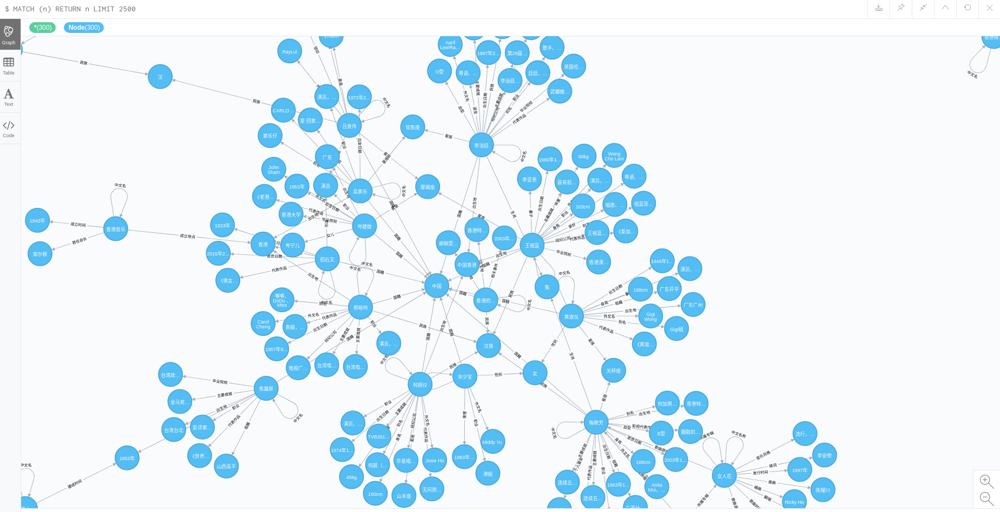

# Algorithm_Business

As an algorithm engineer, thinking about how to help company's business get off the ground | 算法工程师如何结合业务将模型算法迅速落地

本文语境：微信小程序——AI爱家

## 确定需求

1. 目标用户：处在单身，恋爱关系，亲密关系中的人。
2. 功能：以聊天机器人的形式帮助用户理解心理学概念，也能帮助用户进行心理评估，并且能对用户提出的心理学和亲密关系问题给出切实有效的回复。
3. 问题解决：帮助用户处理压力，理解情绪并且能够提供心理学亲密关系等知识
4. 交互方式：文字输入
5. 度量成功：使用次数，以及发送信息的条数，使用时间等指标

## 提升算法

使用机器学习，深度学习算法来更好地理解用户的情绪和需求。这可能需要大量的数据和训练，提高应用的准确性和效用。

### 优化输入

通过输入的 prompt 或 message 信息来为聊天对话设置上下文
```
messages = [
    {"role": "system", "content": "You are a helpful assistant."},
    {"role": "user", "content": "I had a fight with my girlfriend."},
    {"role": "assistant", "content": "I'm sorry to hear that. Do you want to talk about it?"},
    {"role": "user", "content": "Yes, I need some advice."},
]
```
或者为 ChatGPT 指明更具体的角色和任务
```
messages = [
    {"role": "system", "content": "You are an assistant trained in relationship psychology."},
    {"role": "user", "content": "I had a fight with my girlfriend."},
]
```
### 优化输出

尽管ChatGPT通常能够生成高质量的文本，但有时它可能会产生一些不相关或者不准确的信息，可以使用 NLU(Natural Language Understanding) 等后处理策略优化输出

1. 过滤不相关的输出
- 关键词方法：TF-IDF(term frequency and inverse document frequency) 或 Word2Vec
- 主题建模：将文档表示为主题的集合，更能理解文档的结构和内容进而比较不同文档的相似性,LSA and LDA
- 使用时可以需要一个阈值，当相似度低于这个阈值时，我们可以解释为回复相关性不强

2. 知识图谱检查回答准确性
- 

知识图谱效果图：



## 考虑用户体验

确保你的应用易于使用，回应速度快，并且尽可能提供有用的反馈。此外，考虑用户的隐私和安全问题，确保用户的对话内容得到保护。

## 反馈和改进

## 参考文献
1.[算法工程师的核心竞争力——落地能力](https://cloud.tencent.com/developer/article/2117248?from=article.detail.1796795&areaSource=106000.1&traceId=UfHfB6AIB2VYRKaltQrJs)
